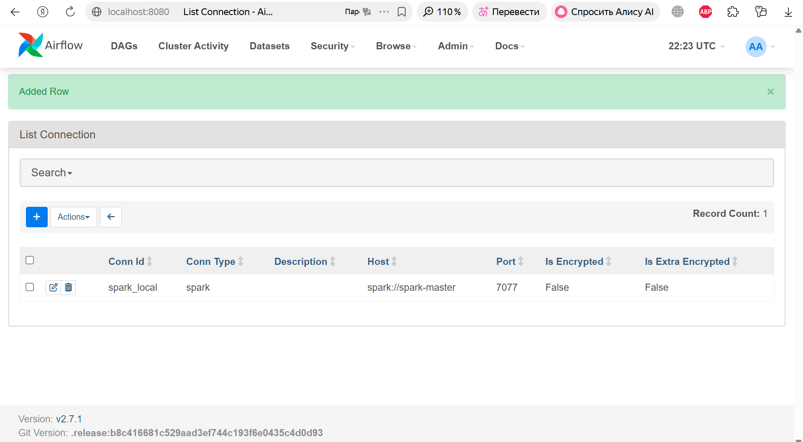
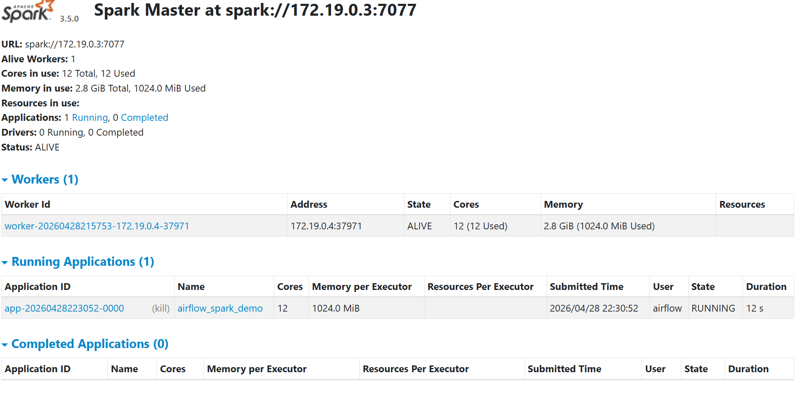
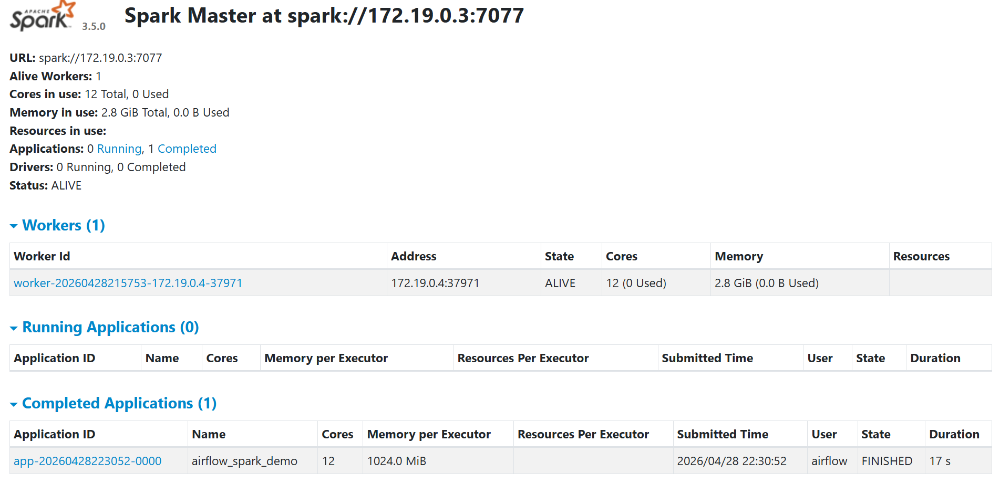

## Airflow + Spark (локальный запуск)

Этот проект поднимает Airflow и Spark-кластер (master + worker) в Docker Compose.
Новый DAG `spark_submit_dag` запускает PySpark-скрипт через `SparkSubmitOperator`.

### Состав

- `dags/minimal_dag.py` — базовый минимальный DAG.
- `dags/spark_submit_dag.py` — DAG для запуска Spark job.
- `spark/my_spark_job.py` — PySpark-скрипт с `SparkSession`.
- `Dockerfile` — кастомный образ Airflow с зависимостями для Spark.
- `docker-compose.yaml` — инфраструктура Airflow + Postgres + Spark.

### Предварительные требования

- Docker Desktop / Docker Engine
- Docker Compose v2

### Запуск

```bash
docker compose up -d --build
```

Очередность запуска сервисов в compose настроена так:

`postgres -> spark-master -> spark-worker -> airflow-init -> airflow-*`

### Настройка подключения Spark в Airflow

1. Откройте Airflow UI: `http://localhost:8080`
2. Перейдите в `Admin -> Connections -> +`
3. Создайте подключение:
   - `Connection Id`: `spark_local`
   - `Connection Type`: `Spark`
   - `Host`: `spark://spark-master`
   - `Port`: `7077`

`conn_id` в DAG должен совпадать с `Connection Id`.

### Запуск DAG

1. В Airflow найдите DAG `spark_submit_dag`
2. Включите DAG и запустите вручную (`Trigger DAG`)
3. Убедитесь, что задача `run_spark_job` завершилась со статусом `success`

### Проверка Spark

- Spark UI: `http://localhost:4040`
- Должны отображаться:
  - подключенный worker;
  - выполненная Spark-задача.

### Результаты работы

#### Скриншоты

**Airflow: создано подключение `spark_local`**



**Spark UI: приложение запущено (`RUNNING`)**



**Spark UI: приложение завершено (`FINISHED`)**



### Остановка

```bash
docker compose down
```
